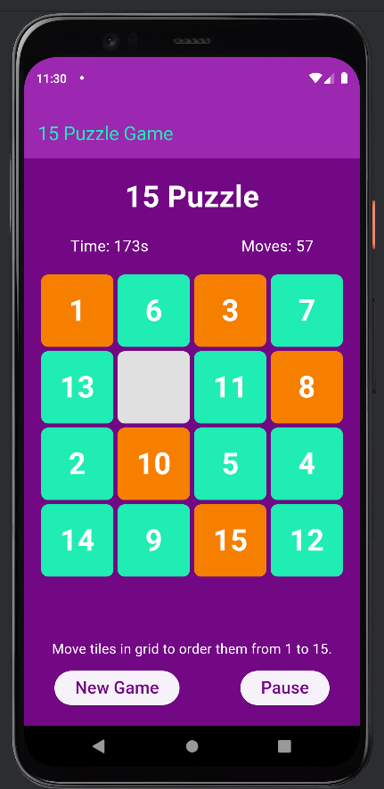

# 🧩 Sliding Puzzle Game

A simple and fun sliding puzzle game built with Flutter! Rearrange the tiles to form the correct image or solve the number grid. A great example project to explore Flutter’s layout, animations, and state management capabilities.

---

## ✨ Features

- Smooth sliding tile animation  
- Randomized puzzle generation  
- Win detection logic  
- Reset button to start over  
- Clean and responsive UI  

---

## 📸 Preview



---

## 🚀 Getting Started

To run this project locally:

1. **Clone the repository**
```bash
git clone https://github.com/hadilmedaouar/Sliding-Puzzle-Game.git
cd Sliding-Puzzle-Game
```
2. **Install dependencies**
```bash
flutter pub get
```
3. **Run the app**
```bash
flutter run
```
